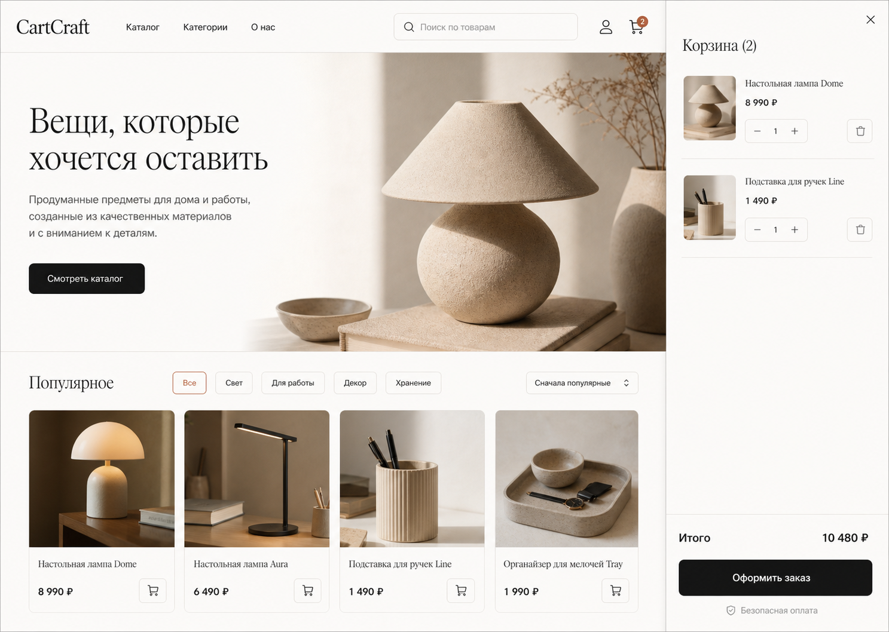

# CartCraft

Учебная full-stack платформа интернет-магазина: покупатель работает с каталогом и заказами, администратор — с товарами, остатками и жизненным циклом заказа. Проект намеренно не позиционируется как production-система.



## Возможности

- Каталог с категориями, текстовым поиском, ценовыми фильтрами и пагинацией API; карточка товара и локальные изображения товаров.
- Регистрация/login с хешированием паролей, JWT Bearer-токеном и RBAC (`USER`/`ADMIN`).
- Серверная корзина, адреса доставки, checkout и история заказов.
- Атомарное резервирование остатков через conditional update внутри serializable-транзакции PostgreSQL: заказ не создаётся, если хотя бы одной позиции не хватает.
- Идемпотентность checkout по ключу на пользователя: повторный запрос возвращает исходный заказ, а не резервирует остатки снова.
- Локальный mock payment provider: UI подтверждает демонстрационный платёж, а входящий `/payments/mock/webhook` принимает только HMAC-SHA256-подписанные события.
- State machine заказа: `PENDING_PAYMENT → PAID → PROCESSING → SHIPPED → DELIVERED`; отмена доступна до сборки и возвращает зарезервированные остатки.
- Админ-панель: остатки редактируются через API, заказы проходят разрешённые статусные переходы.
- Redis-кэш каталога на 60 секунд, инвалидируемый при изменении товара/остатка; при недоступном Redis API остаётся доступным с коротким in-memory fallback и выдаёт degraded health.
- OpenAPI UI: [http://localhost:4000/api/docs](http://localhost:4000/api/docs), healthcheck: [http://localhost:4000/api/health](http://localhost:4000/api/health).

## Стек и архитектура

| Слой | Решение |
| --- | --- |
| Веб | Next.js 16, React 19, TypeScript, CSS modules-free design system |
| API | NestJS 11, TypeScript, class-validator, Swagger/OpenAPI |
| Данные | PostgreSQL 16, Prisma, миграции и seed |
| Производительность | Redis 7 для каталога |
| Инфраструктура | Docker Compose, healthchecks, Makefile, GitHub Actions |

```
apps/web  →  NestJS API  →  PostgreSQL
                  ↘         Redis (каталог)
                   ↘ mock payment webhook (HMAC)
```

Проект разделён на npm workspaces: `apps/web` и `apps/api`. Внешних платёжных ключей нет. Суммы хранятся целыми копейками/рублями (в демо — ₽ без дробной части), а цены и snapshot позиций заказа фиксируются на сервере.

## Быстрый запуск

Требования: Node.js 20+ и Docker Desktop.

```bash
git clone https://github.com/Winlak/cartcraft-commerce-platform.git
cd cartcraft-commerce-platform
cp .env.example .env
docker compose up --build
```

После готовности сервисов:

- Витрина: http://localhost:3000
- API: http://localhost:4000/api
- Swagger: http://localhost:4000/api/docs

Контейнер API автоматически применяет миграции. Для остановки: `docker compose down`; данные PostgreSQL сохраняются в именованном volume `postgres_data`.

### Локальный запуск без контейнеров приложения

PostgreSQL и Redis всё ещё проще поднять через Docker. Затем:

```bash
cp .env.example .env
npm install
npm run db:generate
npm run db:migrate
npm run db:seed
npm run dev
```

`make install`, `make up`, `make dev`, `make db-migrate`, `make db-seed`, `make lint`, `make typecheck`, `make test` и `make build` дублируют основные команды.

## Демо-доступы

| Роль | Email | Пароль |
| --- | --- | --- |
| Покупатель | `user@cartcraft.local` | `DemoPass123!` |
| Администратор | `admin@cartcraft.local` | `DemoPass123!` |

В checkout mock provider автоматически создаёт подписанное событие `payment.succeeded`. Для проверки входящего webhook вручную подпишите сырой JSON телом `HMAC-SHA256(MOCK_PAYMENT_WEBHOOK_SECRET)` и передайте хэш в `X-Mock-Signature`.

## Тесты и качество

```bash
npm run lint
npm run typecheck
npm test
npm run build
npm audit --omit=dev --audit-level=high
```

Unit-тесты покрывают разрешённые переходы state machine, возврат остатков при отмене и отказ conditional stock reservation. Есть тест web-format helpers. GitHub Actions выполняет генерацию Prisma-клиента, lint, typecheck, tests и production build на push/PR в `main`.

Проверка runtime-зависимостей выполняется командой `npm audit --omit=dev --audit-level=high`. Для транзитивной зависимости `@nestjs/swagger > js-yaml` в `package.json` явно зафиксирован безопасный патч `js-yaml` 5.2.3 через npm overrides: это сохраняет совместимость NestJS API и устраняет известную high severity advisory.

## Структура

```
apps/
  api/        NestJS, Prisma schema/migrations/seed, REST API
  web/        Next.js витрина, checkout, кабинет, admin UI
docs/design/  визуальные референсы ключевых состояний
.github/      CI workflow
```

## Решения и компромиссы

- Заказ резервирует `stock`, а не ведёт отдельный ledger резерваций с TTL. Это делает демо-сценарий компактным, но в более сложной системе стоило бы добавить истечение неоплаченного резерва и аудит операций.
- JWT хранится в `localStorage` ради прозрачности single-page demo. Для приложения с браузерной сессией предпочтительнее короткоживущий access token и `httpOnly` refresh cookie с CSRF-стратегией.
- В рамках учебной платформы mock payment подтверждается кнопкой и тем же подписанным обработчиком, а не отдельным сервисом-эмулятором.
- Каталог кэшируется на уровне endpoint; полнотекстовый поиск PostgreSQL, object storage для медиа и очереди фоновых задач не добавлены.

## Визуальные референсы

| Витрина | Checkout / кабинет | Админ-панель |
| --- | --- | --- |
| [storefront](docs/design/storefront-concept.png) | [checkout](docs/design/checkout-account-concept.png) | [admin](docs/design/admin-concept.png) |
